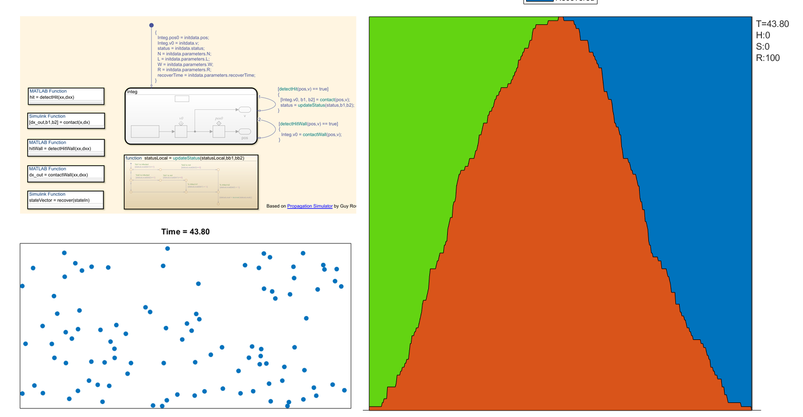

# Моделирование распространения вирусной инфекции COVID-19

Модель позволяет качественно оценить влияние перемещения людей а также карантина на распространение коронавирусной инфекции.

Динамика перемещения людей и распространения инфекции выполнена в Simulink, обработка результатов и визуализация - в MATLAB.

## Требования

* MATLAB R2020a
* Simulink
* Stateflow
* (Рекомендуется) Simulink Coder

## Пробная версия MATLAB

Если у вас нет доступа к лицензии MATLAB R2020a, вы можете оперативно [получить пробную версию](https://exponenta.ru/news/better-at-home-nl).